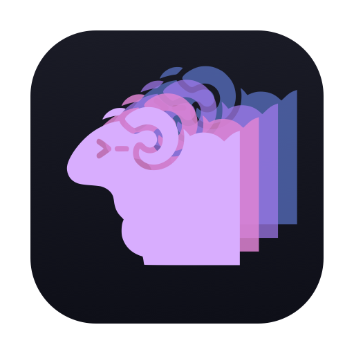

<div align="center">



# Flock

A native macOS window onto your [herdr](https://github.com/herdrdev/herdr) session: every workspace, tab and pane live, in real terminals you can drag around.

[](https://github.com/m4ttstack/flock/releases/latest)
[](https://github.com/m4ttstack/flock/actions/workflows/tests.yml)

</div>

herdr is a terminal multiplexer built for running coding agents side by side.
Flock sits beside it rather than replacing it: it mirrors the session you
already have, renders each pane with [libghostty](https://github.com/ghostty-org/ghostty),
and turns rearranging that session into drag and drop. Quit Flock and herdr
carries on exactly as before.

## Features

- **The whole session, live.** Workspaces in the sidebar, tabs across the top,
  panes laid out the way herdr has them, each one a real terminal you can type
  into.
- **Drag to rearrange.** Move panes between tabs, reorder tabs and workspaces,
  drag dividers to resize. Moves can be undone.
- **Agent status at a glance.** Workspaces, tabs and panes carry herdr's status
  dot: working, waiting on you, finished.
- **A dock for what needs you.** When an agent finishes or asks a question, a
  card appears at the foot of the sidebar. Click it to jump to the pane; it
  clears itself once the pane is seen or the question answered.
- **All Workspaces.** A grid of every workspace at once, for finding the pane
  that just went quiet.
- **One click to an agent.** A new pane offers buttons for the coding agents on
  your `PATH` (Claude Code, Codex).
- **Themes.** Tokyo Night, Catppuccin, Dracula, Nord, Gruvbox, One Dark,
  Solarized, and their light variants.
- **Updates itself.** Release builds update in place with
  [Sparkle](https://sparkle-project.org).

## Requirements

- macOS 15 or later on Apple silicon
- [herdr](https://github.com/herdrdev/herdr) 0.9 or later, on your `PATH`

## Installation

1. Download `Flock-<version>.dmg` from the
   [latest release](https://github.com/m4ttstack/flock/releases/latest).
2. Open it and drag **Flock** onto **Applications**.
3. Open Flock from Applications. It is signed and notarized by Apple, so macOS
   asks only its usual "downloaded from the Internet" question the first time.

From then on Flock checks for updates by itself and installs them quietly.
**Flock > Check for Updates…** checks right away.

## Quickstart

Start herdr the way you normally do, then open Flock. It attaches to your
default herdr session (`~/.config/herdr/herdr.sock`) and shows it straight
away. To open a different session, launch Flock with `HERDR_SOCKET_PATH` set:

```bash
HERDR_SOCKET_PATH=~/.config/herdr/sessions/work/herdr.sock open -a Flock
```

Things to try first:

- Click a workspace in the sidebar, then a tab, then a pane, and type.
- Drag a workspace up or down the sidebar, or a tab along the tab strip.
- Press <kbd>⌘</kbd><kbd>R</kbd> for rearrange mode, where dragging a pane moves
  it instead of selecting text. Drop it on another tab, then press
  <kbd>Esc</kbd>.
- Press <kbd>⇧</kbd><kbd>⌘</kbd><kbd>R</kbd> for All Workspaces.
- Start an agent in a workspace you are not looking at, and watch the dock.

### Keyboard shortcuts

| Shortcut | Action |
|---|---|
| <kbd>⌘</kbd><kbd>T</kbd> | New tab in the current workspace |
| <kbd>⇧</kbd><kbd>⌘</kbd><kbd>N</kbd> | New workspace |
| <kbd>⌘</kbd><kbd>R</kbd> | Rearrange mode (<kbd>Esc</kbd> leaves it) |
| <kbd>⇧</kbd><kbd>⌘</kbd><kbd>R</kbd> | All Workspaces |
| <kbd>⌥</kbd><kbd>⌘</kbd><kbd>←</kbd><kbd>→</kbd><kbd>↑</kbd><kbd>↓</kbd> | Focus the pane on that side |
| <kbd>⌃</kbd><kbd>⌘</kbd><kbd>←</kbd><kbd>→</kbd><kbd>↑</kbd><kbd>↓</kbd> | Move the focused pane that way |
| <kbd>⇧</kbd><kbd>⌃</kbd><kbd>⌘</kbd><kbd>←</kbd><kbd>→</kbd><kbd>↑</kbd><kbd>↓</kbd> | Swap the focused pane with its neighbor that way |
| <kbd>⌥</kbd><kbd>⌘</kbd><kbd>M</kbd>, or click a pane's mouse icon | Switch where the focused pane's plain right-clicks go: its program (the default) or the pane menu. The icon shows while the program has the mouse |
| <kbd>⌥</kbd> + right-click | Whichever of the two a plain right-click does not get |
| <kbd>F2</kbd> | Rename the selected workspace or tab |
| <kbd>⌘</kbd><kbd>Z</kbd> / <kbd>⇧</kbd><kbd>⌘</kbd><kbd>Z</kbd> | Undo / redo a move |
| <kbd>⌘</kbd><kbd>K</kbd> | Clear notifications |
| <kbd>⌘</kbd><kbd>,</kbd> | Settings |

## Settings

- **Notifications > Show in sidebar:** *Until seen* (the default), *For 5
  seconds*, or *Never*. A question from an agent stays until you answer it.
- **herdr > Mouse support:** herdr 0.9.1 does not pass clicks and scrolling
  through to its panes from a client like Flock. Flock carries a build of the
  same herdr version that does, and can install it for you, keeping your
  original to restore later.

## Works with rt

If you run agents with [rt](https://github.com/m4ttstack/rt), Flock picks up a
few extras by itself: herds get their own sidebar section with progress read
from rt, the board app's workspaces fold into a Board section, and rt chat is a
click away. None of it is needed to use Flock with plain herdr.

## Building from source

You need Xcode, [XcodeGen](https://github.com/yonaskolb/XcodeGen)
(`brew install xcodegen`), and a few minutes for the first libghostty build.

```bash
git clone --recursive https://github.com/m4ttstack/flock.git
cd flock
Scripts/libghostty.sh     # builds Vendor/GhosttyKit.xcframework (fetches its own zig)
Scripts/fetch-sparkle.sh  # vendors the pinned Sparkle release
Scripts/build.sh          # xcodegen, then a Debug build
Scripts/run.sh
```

`Flock.xcodeproj` is generated from `project.yml`: edit that and rerun
`xcodegen`, never the project itself. `Scripts/dev-build.sh` builds a separate
`Flock-dev.app` with its own bundle id, so it runs side by side with an
installed Flock.

Run the tests and checks CI runs:

```bash
xcodebuild test -scheme Flock -destination 'platform=macOS' -only-testing:FlockCoreTests -skipPackagePluginValidation
xcodebuild test -scheme FlockChromeRender -destination 'platform=macOS' -skipPackagePluginValidation
Scripts/checks.sh
```

Signing, notarization, the disk image and releasing an update are covered in
[docs/packaging.md](docs/packaging.md).

## Contributing

Issues and pull requests are welcome. Before opening a pull request, run the
two test schemes and `Scripts/checks.sh` above; CI runs the same on every push.
Flock follows herdr rather than leading it, so a change that needs something
herdr does not expose yet is best raised with herdr first.

## License

Flock is under the [Business Source License 1.1](LICENSE): free to use,
including at work, as long as you do not offer it or a derivative as a
commercial terminal emulator, terminal multiplexer or remote-session client.
On 2030-09-20 it becomes MIT. Parts of Flock derive from
[Herdglass](https://github.com/buldezir/Herdglass), which carries the same
terms, and it builds on Ghostty, Sparkle and Inter.
[THIRD-PARTY-NOTICES.md](THIRD-PARTY-NOTICES.md) has the details and every
license.
